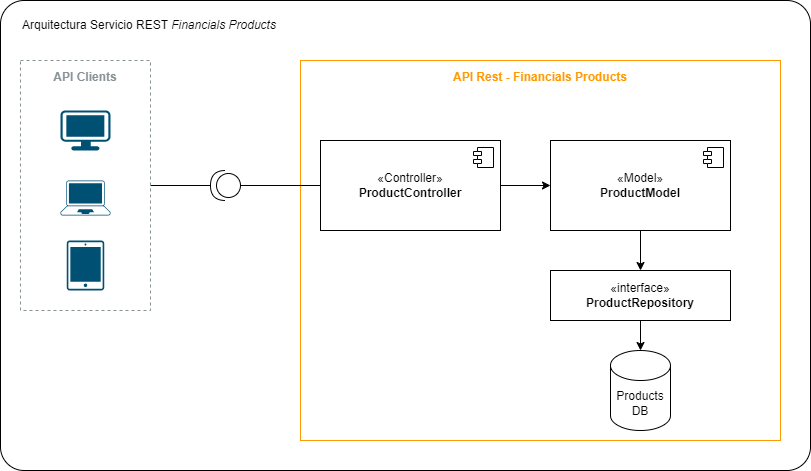

# Proyecto de Demostración Continuous Delivery

### Kyndryl Consult

### Descripción
Este proyecto es una demostración de prácticas DevOps como Unit Test, SAST, CI y CD sobre un microservicio el cual expone una API Rest que permite consultar datos de productos financieros.
Está diseñado para la ejecución de pipelines CI/CD en Github Action. 

### Pasos del Pipeline

- Testing
- Build artifact (.JAR)
- Build and Publish Docker Image (example)
- Deployment on Container App Service (Azure)

### Tecnologias

- Springboot 2.3
- JUnit 5
- Mockito
- JaCoCo 0.8.5
- Docker
- Github actions
- Azure Container Apps

### Arquitectura
El proyecteo está construido sobre una arquitectura MVC (Model-View-Controller)

- Controller: Responsable de recibir las peticiones a traves de API Rest y trasladarla al modelo
- Model: Contiene la definición y mapeo de entidades con el repositorio de datos
- Repository: Interface que gestiona la comunicación con la Base de datos a través del patrón DAO 

---
    author: omar.noriega@kyndryl.com
    date: sep 12 2024

## Clean
    mvn clean

## Build
    mvn install
    
## Local deploy
    mvn spring-boot:run

## Load Testing
    docker-compose up --scale worker=4

### Status
Azure Container App Setup

## Tools
    Sonar
    https://t.ly/lR8zh
    
    DevOps Intelligence
    https://t.ly/W1i3p

    Staging Enviroment
    https://t.ly/-Gs9N